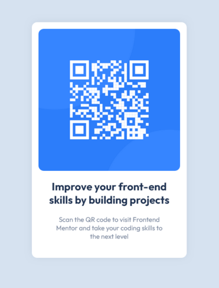

# Frontend Mentor - solução do projeto QR-CODE component

Esta é uma solução para o [desafio do componente de código QR no Frontend Mentor.](https://www.frontendmentor.io/challenges/qr-code-component-iux_sIO_H) Os desafios do Frontend Mentor ajudam você a melhorar suas habilidades de codificação criando projetos realistas.

## Índice

- [Visão geral](#visão-geral)
  - [Screenshot](#screenshot)
  - [Links](#links)
- [Meu processo](#meu-processo)
  - [Desenvolvido com](#desenvolvido-com)
  - [Como desenvolvi](#como-desenvolvi)
  - [Desenvolvimento contínuo](#desenvolvimento-contínuo)  
- [Autor](#autor)
- [Agradecimentos](#agradecimentos)

## Visão geral

### Screenshot



### Links

- [URL da solução no Git](https://github.com/leonardoanselmo/qr-code-component-main)
- [URL do site](https://qr-code-component-main-ruddy-seven.vercel.app/)

## Meu processo

### Desenvolvido com

- HTML5 semântico
- CSS3 propriedades customizadas
- Flexbox

### Como desenvolvi

Antes de começar colocando a mão no código resolvi estruturar o **style.css** resetando as margens e padding, escolhendo o FLEXBOX, pois se tratava apenas de um CARD com todos os elementos abaixo e centralizado e as cores que seriam usadas no projeto em variáveis.

```css
* {
  margin: 0;
  padding: 0;
  box-sizing: border-box;
  font-family: 'Outfit', sans-serif;
}
```

OBS: Veja que deixei o QR-CODE centralizado em tamanho e altura.
```css
body {
  margin: 0 auto;
  max-width: 1440px;
  height: 100vh;
  display: flex;
  flex-direction: column;
  justify-content: center;
  align-items: center;  
  ...
}
```

```css
:root {  
  --white: hsl(0, 0%, 100%);
  --light-gray: hsl(212, 45%, 89%);
  --grayish-blue: hsl(220, 15%, 55%);
  --dark-blue: hsl(218, 44%, 22%);
}
```

No HTML escolhi a TAG semântica ``<section></section>`` por acreditar que poder ser usado como uma seção em um site. 

As TAG´s ````, ``<H2>`` e ``<p>`` foram acrescentadas classes CSS baseado na metodologia BEM.

```html
  <img class="qr-code__img" ... 
  <h2 class="qr-code__title" ...
  <p class="qr-code__paragraph" ...
```

### Desenvolvimento contínuo

Essa foi minha primeira experiência com o modelo do [Frontend Mentor](https://www.frontendmentor.io/challenges/qr-code-component-iux_sIO_H), por mais que eu já venha estudando o desenvolvendo de sites e replicando os exemplos no modelo de assistir e copiar, fazer um card simples como esse, mas sem ter nenhuma referência foi bem gratificante e me fez saber que estou no caminho certo. 

## Autor

- Website - [Léo Ansélmo](https://github.com/leonardoanselmo)
- Frontend Mentor - [@leonardoanselmo](https://www.frontendmentor.io/profile/leonardoanselmo)
- Twitter - [@barblo](https://twitter.com/barblo)

## Agradecimentos

Agradeço a toda equipe do [Frontend Mentor](https://www.frontendmentor.io) por proporcionar um modelo de práticas em desenvolvimento como esse. Logo estarei postando novos projetos aqui! 🚀
